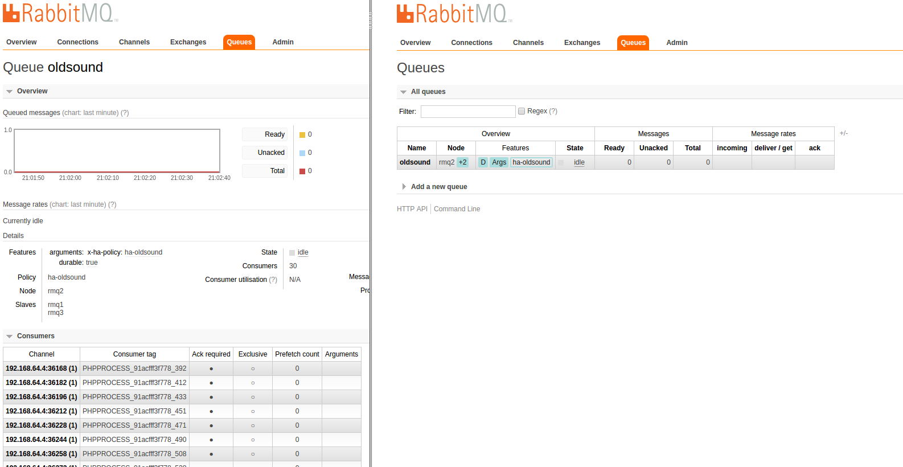
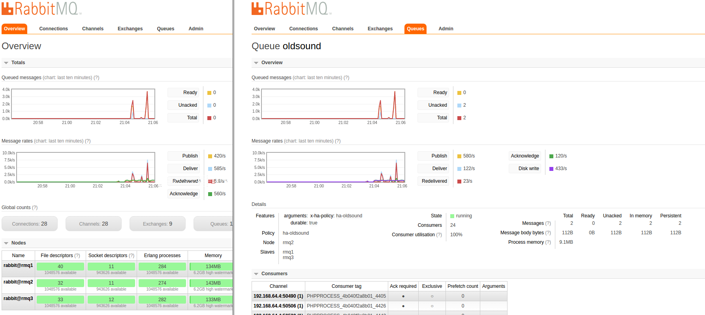

# php-amqplib/RabbitMqBundle

* Of course at this step, you must have followed the [startup instructions](https://github.com/ypereirareis/docker-rabbitmq-ha-cluster/tree/refacto-doc#setup--start--stop-the-cluster).
* **With RabbitMqBundle we use a PUSH strategy, consumers are registered in RabbitMQ**

> With the "push API", applications have to indicate interest in consuming messages from a particular queue. When they do so, we say that they register a consumer or, simply put, subscribe to a queue. It is possible to have more than one consumer per queue or to register an exclusive consumer (excludes all other consumers from the queue while it is consuming).

## Set the ha-policy

```shell
$ make cluster-os
== SWARROT Rabbit Clustering ==
Setting policy "ha-oldsound" for pattern "^oldsound" to " {\"ha-mode\":\"all\",\"ha-sync-mode\":\"automatic\"}" with priority "0" ...
```


## Consumers

```shell
$ make bash
== Connect into PHP container ==
IMPORTANT : Waiting for nothing because no  env var defined !!!
bash-4.3# ./consume.sh oldsound
---------------------------------------------------
> Type: oldsound
> Info: 30 consumers running in parallel reading 100 messages each before finishing
---------------------------------------------------
30 consumers running...
```



## Producers

```shell
$ make bash
== Connect into PHP container ==
IMPORTANT : Waiting for nothing because no  env var defined !!!
bash-4.3# ./produce.sh oldsound
---------------------------------------------------
> Type: oldsound
> Info: 10 producers running in parallel
---------------------------------------------------
10 producers running...
Process 582: 100 more messages added
Process 591: 100 more messages added
```

Once consumers and producers are started you should see messages in the Rabbitmq Management Plugin interface for all nodes.



[Go to Index](../README.md#documentation)  

[Setup](./SETUP.md)  
[Swarrot/SwarrotBundle](./SWARROT.md)  
[OldSound/RabbitMqBundle](./OLDSOUND.md)  
[Node failures](./FAILURE.md)  
[Network partition](./PARTITION.md)  
[Big cluster](./BIG.md)  
